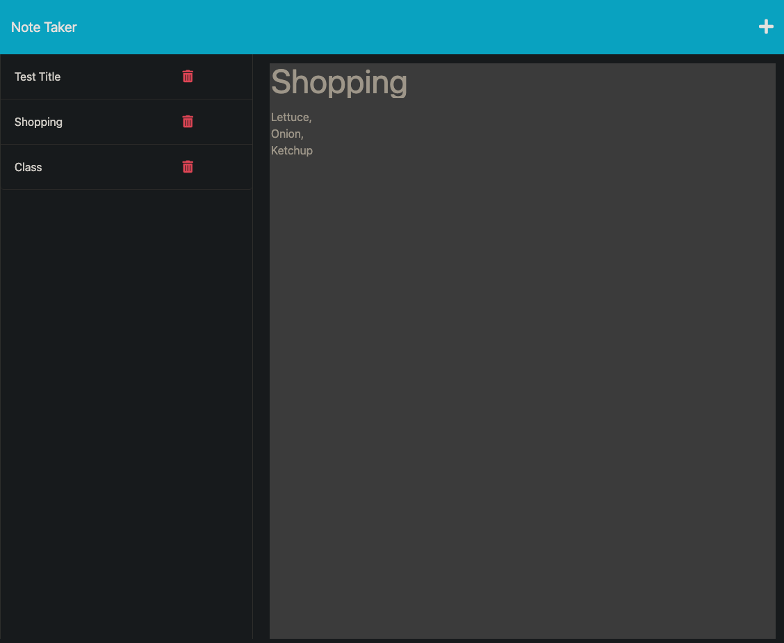

# note-taker

  ## Description

This application is a **note-taking** web application, where the user can enter, create, access, and delete notes within the application. This note taker application will help the users maintain stability and organization with their lives.

  ## Table of Contents
  - [Installation](#installation)
  - [Usage](#usage)
  - [License](#license)
  - [Questions](#questions)

  ## Installation

Git clone the repository.

Please make sure that the **Express** dependency has been downloaded. If not, please run the following command:

`npm i express`

This will install the Express package and version which is necessary for the application to run in. Learn more about [Express](https://www.npmjs.com/package/express).

  ## Usage

To access this note taker application, please run the following command in your integrated terminal for this repository:

`node server.js`

  ## License

This project is licensed under MIT. Please check LICENSE document in repository for more information.

  ## How to Contribute

If you would like to contribute to this project, please open a new issue or submit a pull request.

  ## Tests

There are currently no test for this application

  ## Screen Shot

  ## Questions

  If you have any questions, feel free to reach me at [GitHub](https://github.com/zbichsel) or via email at [biksel09@gmail.com](biksel09@gmail.com).